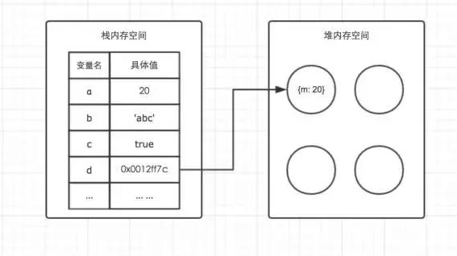

# 深浅拷贝

数据拷贝是 JavaScript 中常见的应用场景，JS 将数据分为基本数据类型和引用数据类型，由于引用数据类型特殊的存储机制，无法简单地通过赋值运算进行拷贝，因此出现了 **浅拷贝** 和 **深拷贝** 这两种不同的拷贝方式。

## JavaScript 存储机制

JS 将数据的存储划分为两个区域，**栈区（Stack）**和**堆区（Heap）**。

栈区用于存储 **基本数据类型的数据** 和 **引用数据类型数据的映射地址** ，映射地址指向堆区中 **引用数据类型数据** 实际的存储位置，堆区用于存储具体的 **引用数据类型数据**。



## 浅拷贝

浅拷贝能够实现基本的数据拷贝功能，但对于深层嵌套的引用数据，例如循环引用的情况，它无法进行有效的拷贝。

```js
const obj = {
	name: "吕威鹏",
	walk: function () {
		console.log("走路");
	},
};
obj.son = obj; // 循环引用

// 1-解构
const obj2 = { ...obj };
// 2-Object.assign()
const obj3 = Object.assign({}, obj);
// 3-序列化：无法克隆函数属性，循环引用会报错
const obj4 = JSON.parse(JSON.stringify(obj));
```

## 深拷贝

深拷贝是 JavaScript 中数据拷贝的终极解决方案。一个完美的深拷贝函数的实现相当复杂，下面为你提供一个相对完整的示例。

```js
const isObject = (data) => {
	return (
		data !== null && (typeof data === "object" || typeof data === "function")
	);
};

const deepClone = (value) => {
	const map = new WeakMap(); // 使用WeakMap记录已处理的数据

	function _deepClone(data) {
		// 1 ------基本数据类型 ------
		if (!isObject(data)) {
			return data;
		}
		// 2  ------引用数据类型 ------
		if (map.has(data)) {
			return map.get(data); // 已处理的数据直接返回
		}
		// 2-1 特殊类型
		if (data instanceof RegExp) {
			return new RegExp(data);
		}
		if (data instanceof Date) {
			return new Date(data.getTime());
		}
		if (data instanceof Function) {
			return data;
		}
		// 2-2 数组和对象
		const result = Array.isArray(data) ? [] : {};
		map.set(data, result); // 保存已处理的映射关系
		for (const key in data) {
			if (Object.prototype.hasOwnProperty.call(data, key)) {
				result[key] = _deepClone(data[key]);
			}
		}
		return result;
	}

	return _deepClone(value);
};
```

- Map 和 WeakMap 的区别

| **对比维度** | **Map**                                                                                              | **WeakMap**                                                                                                                                         |
| ------------ | ---------------------------------------------------------------------------------------------------- | --------------------------------------------------------------------------------------------------------------------------------------------------- |
| 键的类型     | 键可以是**任意类型**（基本类型如字符串、数字，引用类型如对象、数组等都可）                           | 键只能是**对象类型**，使用基本类型（字符串、数字等）作键会报错                                                                                      |
| 引用关系     | 键值对是**强引用**，只要 `Map` 实例存在，键值对就不会被垃圾回收                                      | 键是**弱引用**，若键对象无其他引用，垃圾回收时会自动回收对应键值对                                                                                  |
| 方法和属性   | 支持 `keys()`、`values()`、`entries()`、`forEach()` 等遍历方法，有 `size` 属性、`clear()` 等操作方法 | 不支持遍历（无 `keys()`、`values()` 等遍历方法 ），无 `size` 属性，也没有 `clear()` 方法；仅支持 `set()`、` get``() `、`has()`、`delete()` 基础方法 |
| 内存管理     | 因强引用，若键值对不再使用但 `Map` 未销毁，易造成内存泄漏                                            | 弱引用特性可避免因保留键引用导致的内存泄漏，适合存与对象关联的临时 / 私有数据                                                                       |
| 应用场景     | 需主动管理、遍历键值对的场景，如全局缓存、字典实现、关联数组等                                       | 给对象关联临时元数据且不影响垃圾回收的场景，如 Vue3 响应式依赖收集、DOM 元素附加私有数据                                                            |
