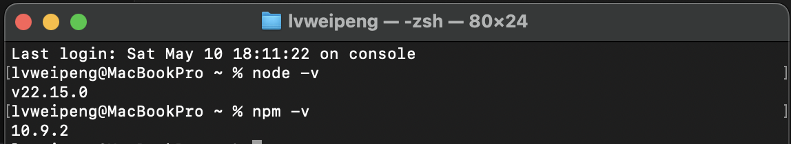
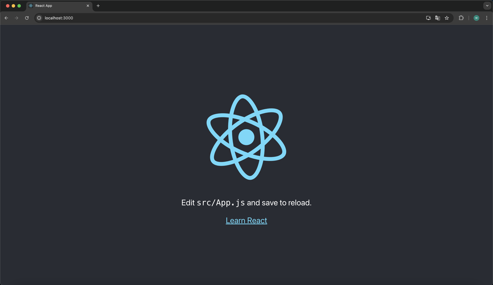

# 创建 React

## 1.准备运行环境

### 1-1.下载并安装 nodeJS

https://nodejs.org/zh-cn

### 1-2.打开终端检查是否安装成功



## 2.快速创建 React 项目

```txt
1.通过React官方脚手架快速创建react项目
    npx create-react-app 项目名称
2.进入创建的项目
    cd 项目名称
3.安装依赖
    npm install
4.运行项目
    npm start
```


