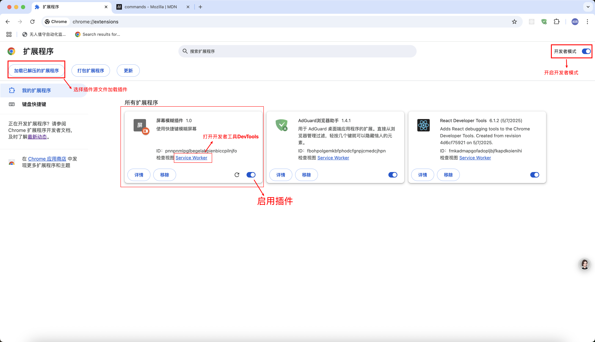
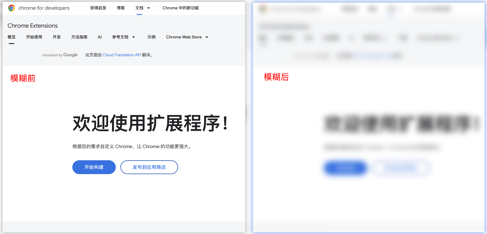

# 快速入门-Chrome 屏幕模糊插件

## 目标

- 通过实现一个简单的插件快速入门浏览器插件的开发
- 实现通过快捷键模糊浏览器视口的效果，应用场景：隐私保护、老板键

## 1.配置文件 manifest.json

```json
{
	"manifest_version": 3,
	"name": "屏幕模糊插件",
	"version": "1.0",
	"description": "使用快捷键模糊屏幕",
	"permissions": ["activeTab", "scripting"],
	"commands": {
		"toggle-blur": {
			"suggested_key": {
				"default": "Alt+Shift+D",
				"mac": "Alt+Shift+D"
			},
			"description": "切换屏幕模糊状态"
		}
	},
	"background": {
		"service_worker": "background.js"
	}
}
```

[permissions](https://developer.mozilla.org/zh-CN/docs/Mozilla/Add-ons/WebExtensions/manifest.json/permissions): 声明需调用的权限。

- activeTab：允许用户激活插件时临时访问当前活动的标签页，交互结束后权限自动收回
- scripting：允许在网页中注入和执行脚本

[commands](https://developer.chrome.com/docs/extensions/reference/api/commands?hl=zh-cn)：声明自定义命令

background: 配置后台服务，主要属性为 [service_worker](https://developer.chrome.com/docs/extensions/develop/concepts/service-workers?hl=zh-cn)

## 2.编写后台服务脚本 background.js

```js
// 添加命令监听事件
chrome.commands.onCommand.addListener((command) => {
	if (command === "toggle-blur") {
		// 查询当前激活的标签页窗口
		chrome.tabs.query({ active: true, currentWindow: true }, (tabs) => {
			// 指定位置注入指定脚本
			chrome.scripting.executeScript({
				target: { tabId: tabs[0].id },
				files: ["content.js"],
			});
		});
	}
});
```

## 3.编写注入脚本 content.js

通过设置 body 节点的 filter 样式实现模糊效果

```js
(function () {
	const body = document.body;
	if (body.style.filter === "blur(10px)") {
		body.style.filter = "";
	} else {
		body.style.filter = "blur(10px)";
	}
})();
```

## 4.加载插件并试用




## 5.兼容性说明

该插件基于 ChromeExtensions 标准开发，理论上可以在 Chrome 和 Edge 浏览器上正常运行。如果需要在 Firefox 浏览器上运行，需要进行一些调整，因为 Firefox 兼容 WebExtensions 标准，可能需要额外处理权限问题。
