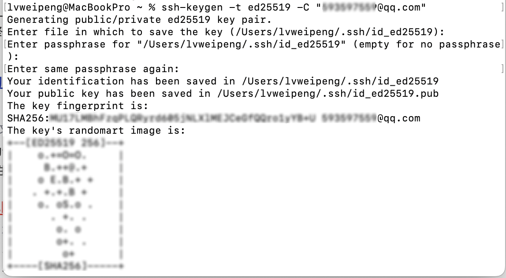

# 解决 GitHub 上传超时问题

你是否存在向 GitHub 上传代码时经常连接超时，一次提交甚至要等几十分钟才能完成的苦恼？不妨采用 SSH 协议建立通信通道，一次性解决连接超时的疑难杂症。

## 1.为什么采用 SSH 协议？

SSH 协议比 Https 协议更安全更高效，适合频繁提交的应用场景，技术型用户的首选！

| **协议**         | **SSH**                                           | **HTTPS**                                                |
| ---------------- | ------------------------------------------------- | -------------------------------------------------------- |
| **认证方式**     | 基于密钥对（公钥 / 私钥）&#xA;                    | 基于用户名 + 密码或令牌（如 Personal Access Token）&#xA; |
| **安全性**       | 更高（私钥本地存储，无需传输密码）&#xA;           | 中等（需妥善保管令牌，传输过程加密）&#xA;                |
| **配置复杂度**   | 高（需生成密钥对并添加到 GitHub）&#xA;            | 低（直接使用账号密码或令牌）&#xA;                        |
| **防火墙兼容性** | 可能被企业防火墙拦截（默认端口 22）&#xA;          | 几乎都允许（默认端口 443）&#xA;                          |
| **使用场景**     | 长期开发（频繁 push/pull，无需重复输入凭证）&#xA; | 临时克隆、只读访问或受限网络环境&#xA;                    |

## 2.配置并使用 SSH 协议

### 2-1 生成 SSH 密钥对

1.  **打开终端**

- Windows：用 Git Bash（安装 Git 后自带）。
- macOS/Linux：直接打开系统终端。

2.  **执行生成命令**

```bash
ssh-keygen -t ed25519 -C "your\_email@example.com"
```

- `ed25519` 是推荐的现代密钥算法，也可用 `rsa`（如 `ssh-keygen -t rsa -b 4096 -C "邮箱"` ）。

- `your_email@example.com` 替换为你 GitHub 账号绑定的邮箱。

3.  **设置保存路径**

- 按回车用默认路径（一般是 `~/.ssh/` ），生成 `id_ed25519`（私钥）和 `id_ed25519.pub`（公钥）。

- 执行生成命令时增加 `-f` 可指定密钥的生成路径和文件名，如`-f ~/.ssh/id_ed25519_github`。

4.  **设置密码（可选）**

    直接回车可跳过（无密码更方便，但安全性稍低；设密码则每次用密钥需输密码）。



### 2-2 将公钥添加到 GitHub

1.  **复制公钥内容**

```bash
cat \~/.ssh/id\_ed25519.pub
```

复制输出的公钥文本（类似 `ssh-ed25519 AAAAC3... 邮箱` ）。

2.  **GitHub 粘贴公钥**

- 登录 GitHub → 点击右上角头像 → **Settings** → 左侧 **SSH and GPG keys** → 点击 **New SSH key**。

- “Title”填易识别名称（如 “MacBook Pro 工作机” ），“Key Type”选 Authentication Key（认证密钥），“Key” 粘贴刚复制的公钥，点击 **Add SSH key**。

### 2-3 配置本地 SSH（可选）

若有多个密钥或需自定义配置，编辑 `~/.ssh/config` 文件（无则创建）：

```YAML
Host github.com # 自定义名称，用于替代实际域名
  HostName github.com # 实际域名
  User git
  IdentityFile ~/.ssh/id_ed25519 # 私钥路径，按实际文件名改
  IdentitiesOnly yes  # 强制只用这个密钥
  # Port 443 # 若22端口被封，可解开这行注释用443端口

Host github-personal
  HostName github.com
  User git
  IdentityFile ~/.ssh/id_ed25519_personal
  IdentitiesOnly yes

Host github-work
# ......
```

### 2-4 验证 SSH 连接

终端执行：

```
ssh -T git@github.com
```

- 首次连接会提示确认 GitHub 主机指纹，输入 `yes` 回车。

- 若成功，会显示 `Hi [你的GitHub用户名]! You've successfully authenticated...`；若失败，检查公钥是否上传正确、密钥权限（私钥需 `600` 权限，用 `chmod 600 ~/.ssh/id_ed25519` 调整 ）。
- 若本地配置过 ssh，`github.com`需和你配置文件的 Host 对应，如`github-personal`、`github-work`

### 2-5 关联本地仓库（若仓库用 HTTPS 需切换）

若本地 Git 仓库之前是 HTTPS 链接，执行：

```
git remote set-url origin git@github.com:用户名/仓库名.git
```

- 替换 `用户名/仓库名` 为实际信息，之后 `git push`/`git pull` 就会用 SSH 认证。
- 若本地配置过 ssh，`github.com`需和你配置文件的 Host 对应，如`github-personal`、`github-work`

🎉 按以上步骤，就能完成 GitHub SSH 链接配置，后续拉取、推送代码更便捷～

## 3.常见问题处理

- **端口 22 连接超时**：参考配置 `config` 文件里的 `Port 443`，或换网络（如手机热点）试试。

- **Still no key?**：确认 `ssh-add ~/.ssh/id_ed25519` 加载私钥（Mac/Linux 可能需启动 SSH 代理：`eval "$(ssh-agent -s)"` ）。
